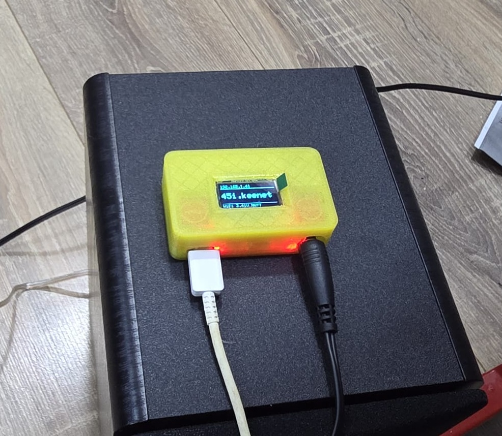
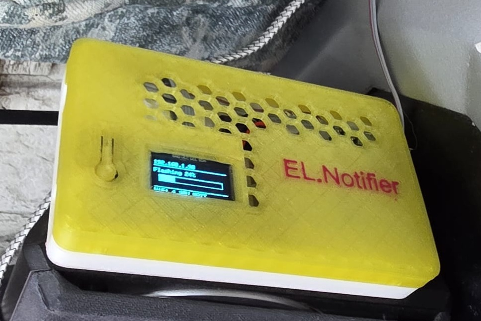
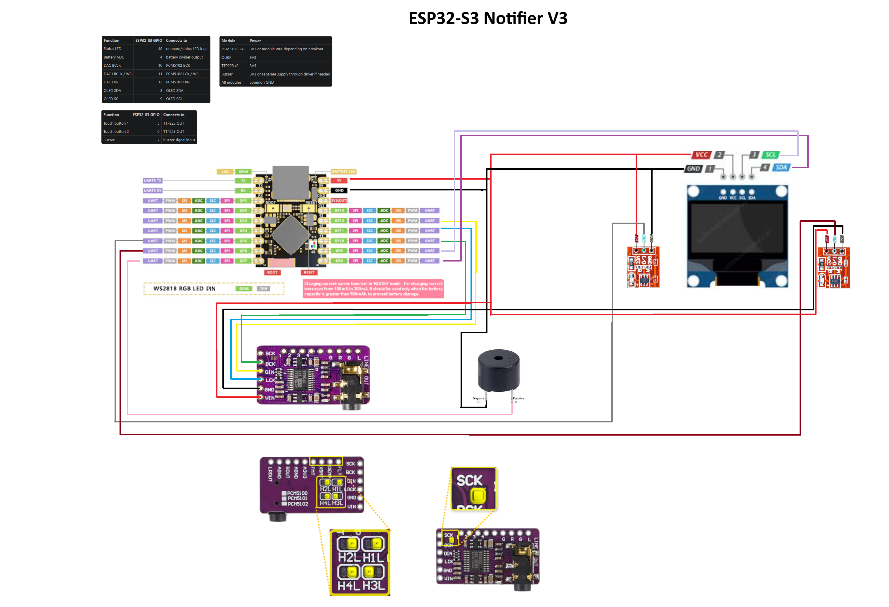

# ESP32 Notifier for Home Assistant

PlatformIO firmware for an ESP32-based Wi-Fi audio notifier / speaker with:

- ESP32 Arduino framework
- local web UI with separate HTML, CSS, and JavaScript assets
- Wi-Fi station mode plus fallback AP configuration mode
- MQTT command and state bridge for Home Assistant
- I2S audio output for MP3 streams, radio streams, and URL-based TTS playback
- OTA checks and installs from a GitHub release or manifest URL
- battery voltage monitoring with smoothing and calibration
- OLED status display support for SSD1306 and SH1106 panels
- compile-time defaults plus saved settings in Preferences / NVS

This project is not ESPHome. It is a custom modular PlatformIO firmware baseline intended to be realistic, buildable, and extendable.

## Hardware Gallery

| Notifier V3 | Notifier V1 |
|---|---|
|  |  |

## Project Overview

This notifier project is based on the third hardware iteration of a Home Assistant speaker / notifier build.

The main design goal of that iteration was to simplify the previous versions and make the system more practical for day-to-day use:

- low-voltage operation instead of bulkier higher-voltage amplifier setups
- reduced heat inside a printed enclosure
- less interference and easier wiring
- battery-capable operation
- the ability to drive an existing passive ceiling speaker when needed
- a compact all-in-one Home Assistant audio endpoint without adding a separate Bluetooth speaker

The intended usage is broader than simple beeps. The device is meant to handle:

- Home Assistant speech and notification playback
- soft background music
- internet radio streams
- compact room audio for built-in speakers or powered speakers

The firmware in this repository documents and supports that direction, while keeping the implementation focused on maintainable ESP32 firmware modules.

## Current Status

The repository builds successfully with PlatformIO and emits [firmware.bin](.pio/build/esp32_notifier/firmware.bin) locally.

Current firmware version in this repository:

- `v0.1.9`

Recent firmware and web UI updates included in this version:

- documentation now covers the Notifier V3 hardware build based on the ESP32-S3 Super Mini, PCM5102 DAC, dual TTP223 touch sensors, buzzer, and 0.96 inch OLED
- added the Notifier V3 circuit diagram and direct casing STL references to the repository documentation
- added a PCM5102 bring-up tutorial reference and jumper guidance for the common purple PCM5102 breakout used by this build
- the Firmware tab now lists each GitHub firmware asset separately, so Standard and HACS builds appear as distinct install options with inline notes explaining what each variant is for
- release refresh from GitHub now retries automatically in the background after a single Check Releases action instead of requiring repeated button presses
- Home Assistant HACS media-player playback now accepts the custom integration playmedia payload format more reliably
- reduced heap churn while audio is active by streaming status JSON responses and skipping duplicate playback-state publications when the device page polls during playback
- audio I2S output is enabled again in the main build, with larger OTA slots and tuned stream buffering for more reliable playback
- the Audio tab now includes Radio Browser country and station pickers, remembers the browser selection, and uses a single Play or Stop button
- the dashboard now shows a battery icon with estimated percentage and a Wi-Fi signal indicator with RSSI quality
- low-battery deep sleep can now be configured from the Device tab, including threshold and wake interval persistence
- Wi-Fi station connect now prefers the strongest matching BSSID when several mesh nodes share the same SSID
- volume changes now update playback immediately while deferring NVS persistence to avoid interrupting active streams
- the dedicated `esp32_notifier_hacs` build now publishes a discovery and control contract compatible with the `bkbilly/mqtt_media_player` integration while keeping the web UI enabled

The Home Assistant media-player path documented in this repository uses the HACS integration [`bkbilly/mqtt_media_player`](https://github.com/bkbilly/mqtt_media_player) together with the `esp32_notifier_hacs` firmware profile:

- `play URL`
- `play TTS URL`
- `stop`
- `set volume`

The firmware publishes MQTT state for:

- availability
- playback
- battery voltage
- Wi-Fi / network status

Current limitation:

- Home Assistant core MQTT discovery alone is still not enough for a media-player entity on the default firmware profile
- use the `esp32_notifier_hacs` build together with [`bkbilly/mqtt_media_player`](https://github.com/bkbilly/mqtt_media_player) when you want the notifier discovered as a Home Assistant media player
- if the firmware is built with the diagnostic audio-disable flag enabled, playback actions will not start audio until that build flag is removed

## Notifier V3 Hardware

The current documented hardware target is Notifier V3, built around the ESP32-S3 Super Mini and these external modules:

- ESP32-S3 Super Mini controller board
- PCM5102 I2S DAC breakout
- 0.96 inch I2C OLED display
- two TTP223 touch sensor modules
- active buzzer

Repository-local hardware references:

- Circuit diagram: [Docs/Notifier_v3.png](Docs/Notifier_v3.png)
- ESP32-S3 pinout image: [Docs/esp32-s3_pinout.jpeg](Docs/esp32-s3_pinout.jpeg)
- STL folder: [3D/STL](3D/STL)
- Top cover STL: [3D/STL/Notifier_box_v3_top.stl](3D/STL/Notifier_box_v3_top.stl)
- Back cover STL: [3D/STL/Notifier_box_v3_bot.stl](3D/STL/Notifier_box_v3_bot.stl)

Notifier V3 circuit diagram:



Useful external bring-up tutorial for the PCM5102 on ESP32:

- https://www.makerguides.com/playing-audio-with-esp32-and-pcm5102/

That tutorial is a good practical reference for first audio bring-up, especially when you want to validate PCM5102 power, I2S wiring, and line-out behavior before testing the full notifier stack.

### ESP32-S3 Super Mini Wiring

The repository also includes ESP32-S3 build profiles in [platformio.ini](platformio.ini):

- `esp32s3_notifier`
- `esp32s3_notifier_hacs`

These profiles are configured for the ESP32-S3 Super Mini / Waveshare ESP32-S3-Zero class board using PlatformIO's `esp32-s3-devkitm-1` board definition, which Waveshare recommends for PlatformIO. The default repo configuration assumes the common `4 MB flash / 2 MB PSRAM` variant and enables native USB CDC on boot for serial logs over the USB-C port.

Suggested default wiring for those ESP32-S3 profiles:

| Function | GPIO |
|---|---:|
| Status LED | 48 |
| Battery ADC | 4 |
| I2S DOUT | 12 |
| I2S LRCLK / WS | 11 |
| I2S BCLK | 10 |
| OLED SDA | 8 |
| OLED SCL | 9 |
| Touch button 1 | 5 |
| Touch button 2 | 6 |
| Buzzer | 7 |

These defaults avoid the board's built-in RGB LED path and match the GPIOs exposed on the Super Mini board. They are still configurable later from the web UI or in the build flags if you rewire.

Board-specific notes:

- onboard WS2812 RGB LED is on `GPIO21`, so leave that pin free unless you intentionally want to drive the LED
- native USB is used for upload and serial logs; if flashing is unreliable, hold `BOOT` while connecting USB-C and then retry
- if your Super Mini is the larger `8 MB flash / 8 MB PSRAM` variant instead of `4 MB / 2 MB`, switch the partition file back to [partitions/ota_8m.csv](partitions/ota_8m.csv) and increase `board_upload.flash_size`

Module wiring summary for Notifier V3:

| Module | Pin | ESP32-S3 Super Mini GPIO |
|---|---|---:|
| PCM5102 | BCK | 10 |
| PCM5102 | LCK / WS | 11 |
| PCM5102 | DIN | 12 |
| PCM5102 | GND | GND |
| PCM5102 | VIN | 5V or module VIN input expected by your breakout |
| OLED | SCL | 9 |
| OLED | SDA | 8 |
| OLED | VCC | 3V3 |
| OLED | GND | GND |
| TTP223 #1 | OUT | 5 |
| TTP223 #2 | OUT | 6 |
| TTP223 modules | VCC | 3V3 |
| TTP223 modules | GND | GND |
| Buzzer | signal | 7 |
| Buzzer | GND | GND |

PCM5102 notes for the common purple breakout shown in [Docs/Notifier_v3.png](Docs/Notifier_v3.png):

- the common jumper setup for 3-wire ESP32 use is `1 = L`, `2 = L`, `3 = H`, `4 = L`
- the `SCK` header pin is left unconnected to the ESP32 in this project
- the back-side jumper configuration forces the module into the expected no-MCLK mode
- the PCM5102 is a line-out DAC, so connect it to an amplifier or powered speaker, not directly to a passive speaker

## Hardware Modules

Notifier V3 is documented around this practical module stack:

- ESP32-S3 Super Mini
- PCM5102 I2S DAC breakout
- 0.96 inch SSD1306 or SH1106 I2C OLED
- two TTP223 touch buttons
- active buzzer
- optional amplifier or powered speaker connected to the PCM5102 line output

Why this combination is used in V3:

- the ESP32-S3 Super Mini keeps the board compact while still exposing enough GPIO for audio, display, buttons, and battery measurement
- the PCM5102 works cleanly with the firmware's current 3-wire I2S audio path
- the TTP223 modules provide simple physical controls without mechanical button hardware inside the printed case
- the OLED gives immediate local status feedback for Wi-Fi, playback, and setup state
- the buzzer provides a lightweight local indicator path in addition to streamed audio

## Parts and Resources

Practical resources for the current V3 build:

- Main board family: ESP32-S3 Super Mini
- Audio DAC: PCM5102 breakout module
- Touch inputs: 2x TTP223
- Display: 0.96 inch I2C OLED
- Local indicator: active buzzer
- Enclosure: [3D/STL/Notifier_box_v3_top.stl](3D/STL/Notifier_box_v3_top.stl) and [3D/STL/Notifier_box_v3_bot.stl](3D/STL/Notifier_box_v3_bot.stl)
- Reference audio bring-up tutorial: https://www.makerguides.com/playing-audio-with-esp32-and-pcm5102/

Related external references mentioned in the overview:

- Home Assistant community schematic / discussion: https://community.home-assistant.io/t/i2s-stereo-to-play-mp3-tts-from-flash-on-boot/594740/6?u=elik745i
- Older notifier discussion: https://community.home-assistant.io/t/turn-an-esp8266-wemosd1mini-into-an-audio-notifier-for-home-assistant-play-mp3-tts-rttl/211499/224?u=elik745i
- External 3D model reference mentioned in the overview: https://www.thingiverse.com/thing:6910612

## Project Layout

- [platformio.ini](platformio.ini)
- [Docs/lolin32_lite_pinout.png](Docs/lolin32_lite_pinout.png)
- [Docs/Wemos-ESP32-Lolin32-Board-BOOK-ENGLISH.pdf](Docs/Wemos-ESP32-Lolin32-Board-BOOK-ENGLISH.pdf)
- [3D](3D)
- [include/default_config.h](include/default_config.h)
- [include/settings_schema.h](include/settings_schema.h)
- [include/version.h](include/version.h)
- [src/main.cpp](src/main.cpp)
- [src/settings_manager.cpp](src/settings_manager.cpp)
- [src/wifi_manager.cpp](src/wifi_manager.cpp)
- [src/mqtt_manager.cpp](src/mqtt_manager.cpp)
- [src/audio_player.cpp](src/audio_player.cpp)
- [src/ota_manager.cpp](src/ota_manager.cpp)
- [src/web_server.cpp](src/web_server.cpp)
- [src/battery_monitor.cpp](src/battery_monitor.cpp)
- [src/display_manager.cpp](src/display_manager.cpp)
- [src/ha_bridge.cpp](src/ha_bridge.cpp)
- [web/index.html](web/index.html)
- [web/style.css](web/style.css)
- [web/app.js](web/app.js)

## Library Choices

- Async web server: `ESPAsyncWebServer` with `AsyncTCP`
- MQTT: `AsyncMqttClient`
- JSON: `ArduinoJson`
- Audio playback: `schreibfaul1/ESP32-audioI2S` pinned to the last tag compatible with this ESP32 toolchain and framework line
- OLED: `Adafruit SSD1306`, `Adafruit SH110X`, `Adafruit GFX`
- Storage: `Preferences`

The audio library was intentionally pinned to an older compatible tag because newer tags require C++ and ESP-IDF features not available in the default PlatformIO ESP32 Arduino toolchain used here.

## Build Instructions

1. Open this folder in VS Code.
2. Install PlatformIO IDE if needed.
3. Build:

```powershell
pio run
```

  For the MQTT Media Player compatible firmware profile with the web UI still enabled:

```powershell
pio run -e esp32_notifier_hacs
```

4. Upload:

```powershell
pio run -t upload
```

5. Open serial monitor:

```powershell
pio device monitor -b 115200
```

## VS Code Workflow

The repository now includes VS Code workspace files under [.vscode](.vscode) so you can work from the VS Code UI without manually typing the PlatformIO commands each time.

Recommended extension:

- `PlatformIO IDE`

Available task labels in VS Code:

- `PlatformIO: Verify`
- `PlatformIO: Upload (Auto Port)`
- `PlatformIO: Monitor (Auto Port)`
- `PlatformIO: List Serial Devices`

How to use them in VS Code:

1. Open `Terminal -> Run Task`.
2. Choose `PlatformIO: Verify` to build.
3. Choose `PlatformIO: Upload (Auto Port)` to flash the board.
4. Choose `PlatformIO: Monitor (Auto Port)` to open the serial monitor.

Serial-port behavior:

- the project intentionally does not hardcode `upload_port`
- PlatformIO is allowed to auto-discover the serial adapter
- at the time of setup, PlatformIO detected a `USB-SERIAL CH340` device on `COM4`

If Windows later renumbers the port, the tasks still keep working as long as PlatformIO can see a single matching ESP32 serial adapter.

## First Flash and Provisioning

On boot the firmware does this:

1. Loads saved settings from Preferences if present.
2. Otherwise applies hardwired defaults from [include/default_config.h](include/default_config.h).
3. Attempts Wi-Fi STA mode if an SSID is configured.
4. If STA credentials are missing or the connection does not come up in time, starts fallback AP mode.

Fallback AP behavior:

- AP SSID: `ESP32-Notifier-XXXXXX`
- AP password: `configureme`
- Config URL: `http://192.168.4.1`

The web UI is served in both AP mode and normal LAN mode.

## Web UI

The frontend is stored in separate files under [web](web) and embedded into firmware at build time by [scripts/asset_embed.py](scripts/asset_embed.py).

The page allows you to:

- inspect Wi-Fi, IP, MQTT, firmware, battery, playback, and heap status
- test playback with a URL
- stop playback
- adjust volume
- edit Wi-Fi, MQTT, OTA, battery, device, OLED, and web auth settings
- reboot
- factory reset saved settings
- trigger an OTA check or install

The visual structure and Wi-Fi provisioning flow intentionally follow the same practical template style used in your pressure transducer project.

## Enclosure and Assembly

The project overview describes a compact printed enclosure workflow:

- reuse existing 3D models where practical
- create custom CAD when no suitable enclosure exists
- confirm dimensions from PCB photos, caliper measurements, and known reference spacing
- secure the finished modules inside the enclosure with adhesive mounting rather than complicated brackets

Repository-local enclosure resources are available in [3D](3D), with the current Notifier V3 printable parts here:

- Top cover: [3D/STL/Notifier_box_v3_top.stl](3D/STL/Notifier_box_v3_top.stl)
- Back cover: [3D/STL/Notifier_box_v3_bot.stl](3D/STL/Notifier_box_v3_bot.stl)

The hardware story in the overview is useful context here: the case design was driven by the desire to keep the notifier compact, battery-friendly, and resistant to the heat problems caused by earlier amplifier choices.

## Hardwired Defaults and Saved Settings

Compile-time defaults live in [include/default_config.h](include/default_config.h).

Saved settings live in ESP32 Preferences / NVS and override compile-time defaults.

Precedence rules:

1. Saved settings from Preferences are loaded first if the settings marker exists.
2. If no saved settings are present, defaults from [include/default_config.h](include/default_config.h) are used.
3. Saving through the web UI writes persistent values that override defaults on future boots.

Persisted values include:

- Wi-Fi SSID and password
- MQTT host, port, username, password, client ID, base topic
- device and friendly name
- OTA repository, channel, asset template, manifest URL
- battery calibration multiplier, ADC update interval, moving average window size
- saved volume
- OLED settings
- optional web auth settings

## MQTT Topics

Default base topic:

- `esp32_notifier`

Command topics:

- `esp32_notifier/cmd/play`
- `esp32_notifier/cmd/tts`
- `esp32_notifier/cmd/stop`
- `esp32_notifier/cmd/volume`

State topics:

- `esp32_notifier/availability`
- `esp32_notifier/state/playback`
- `esp32_notifier/state/network`
- `esp32_notifier/state/battery`
- `esp32_notifier/state/volume`

Example payloads:

Play URL:

```json
{"url":"https://example.com/stream.mp3","label":"Test Stream","type":"stream"}
```

Play TTS URL:

```json
{"url":"https://example.local/tts/doorbell.mp3","label":"Doorbell","type":"tts"}
```

Volume:

```json
{"volumePercent":55}
```

## Home Assistant Setup

Example HA files are included in [home_assistant](home_assistant).

Recommended media-player integration:

- Use [`bkbilly/mqtt_media_player`](https://github.com/bkbilly/mqtt_media_player) from HACS with the `esp32_notifier_hacs` firmware build.
- A vendored backup copy of that integration is included under [home_assistant/custom_components/mqtt_media_player](home_assistant/custom_components/mqtt_media_player) in case the upstream repository becomes unavailable.
- Keep Home Assistant's core MQTT integration enabled so the notifier can publish discovery, state, and command topics through your broker.
- Use `esp32_notifier_hacs_slim` only if you explicitly want a no-web fallback build.

Step-by-step Home Assistant setup:

1. Install the `bkbilly/mqtt_media_player` integration from HACS.
2. Build and flash the `esp32_notifier_hacs` environment instead of the default firmware profile.
3. Keep Home Assistant's core MQTT integration enabled so the notifier can publish its discovery payload and retained state topics.
4. Remove any stale retained discovery topic left from older test builds, especially `homeassistant/media_player/<device_name>/hacs_player/config`, if it still exists on the broker.
5. Restart Home Assistant or reload both the MQTT integration and the `MQTT Media Player` custom integration.
6. The integration should discover the notifier from `homeassistant/media_player/<device_name>/config` and subscribe to `<base_topic>/hacs/...` plus `<base_topic>/hacs/cmd/...`.
7. Use `esp32_notifier_hacs_slim` only if you explicitly want a no-web fallback build.

Experimental HACS MQTT media-player compatibility:

- Build `esp32_notifier_hacs` when you want the MQTT Media Player compatible firmware profile with the web UI still enabled.
- That profile additionally publishes flat retained topics under `<base_topic>/hacs/` for `state`, `title`, `mediatype`, and `volume`, with volume normalized to `0..1` for MQTT Media Player compatibility.
- It publishes its discovery payload at `homeassistant/media_player/<device_name>/config`, which matches the [`bkbilly/mqtt_media_player`](https://github.com/bkbilly/mqtt_media_player) integration's expected discovery path.
- The profile exposes dedicated compatibility command topics under `<base_topic>/hacs/cmd/` for `play`, `pause`, `playpause`, `stop`, `volume`, and `playmedia`.
- Existing notifier JSON topics remain available for automations that publish directly to MQTT.
- `next` and `previous` are accepted as compatibility no-ops because the notifier does not implement queue-based transport controls.
- Use `esp32_notifier_hacs_slim` only if you explicitly want a no-web fallback build.

Practical TTS options right now:

1. Use a TTS engine or workflow that can produce a directly reachable MP3/HTTP URL.
2. Publish that URL to `esp32_notifier/cmd/tts` or trigger it through an automation that sends the same MQTT command.

Media and radio playback are straightforward today because they are already URL-based.

## Sound Quality Notes

The original project overview includes two useful real-world expectations:

- with a basic passive ceiling speaker, the goal is practical speech and light background audio rather than hi-fi playback
- when connected to better powered speakers, the UDA1334-based I2S path can sound noticeably better than expected for such a small and inexpensive module stack

That matches the intended role of this firmware: reliable notifier and room-audio endpoint first, rather than a full-featured audiophile streamer.

## OTA From GitHub Releases

The firmware supports two OTA metadata strategies:

1. Preferred: a lightweight JSON manifest URL
2. Fallback: GitHub Releases API lookup

Recommended manifest shape:

```json
{
  "version": "v0.1.9",
  "url": "https://github.com/elik745i/ESP32-Notifier-for-Homeassistant/releases/download/v0.1.9/esp32-notifier-v0.1.9.bin",
  "asset": "esp32-notifier-v0.1.9.bin",
  "sha256": "<optional sha256>",
  "channel": "stable"
}
```

Release asset naming strategy used by default:

- `esp32-notifier-${version}.bin`

OTA notes:

- If a manifest provides `sha256`, the firmware verifies it while streaming the update.
- If no manifest is provided, the firmware falls back to GitHub release metadata and asset naming.
- OTA install is currently triggered manually from the web UI or API.

## Battery Monitoring

Battery monitoring is handled by [src/battery_monitor.cpp](src/battery_monitor.cpp).

Battery input and defaults:

- GPIO pin: `GPIO36`
- ADC source: ESP32 internal ADC
- default calibration multiplier: `3.866`
- default smoothing: moving average
- default moving average window: `10` samples

Calculation path:

1. read raw ADC from `GPIO36`
2. convert the raw ADC reading to ADC pin voltage using `3.3 V * raw / 4095`
3. multiply that voltage by the configured battery correction multiplier
4. apply a moving average over the configured window size
5. publish and display the filtered battery voltage

Configurable battery settings:

- calibration multiplier
- ADC update interval
- moving average window size

The default behavior intentionally matches the previous ESPHome setup as closely as possible:

`raw ADC -> multiply by 3.866 -> moving average over 10 samples -> publish final voltage`

### Recalibration

If the reported battery voltage is off, recalibrate it with a multimeter:

1. Measure the actual battery voltage directly with a multimeter.
2. Compare that value to the voltage reported in the web UI or MQTT state.
3. Compute a corrected multiplier:

  `new_multiplier = old_multiplier * (actual_voltage / reported_voltage)`

4. Save the new `calibration multiplier` in the web UI.
5. Let the moving average settle for about 10 samples before judging the result.

## OLED Behavior

OLED support is handled by [src/display_manager.cpp](src/display_manager.cpp).

Displayed layout:

- top row: IP address or AP SSID
- center: current media title, TTS preview, OTA state, or idle / setup text
- bottom row: Wi-Fi / MQTT / playback summary

The display refreshes on an interval and supports simple scrolling for longer center text.

## Factory Reset

Factory reset from the web UI clears Preferences and reboots.

After reset:

- saved settings are removed
- hardwired defaults become active again
- AP fallback will start if Wi-Fi is not configured by defaults

## Troubleshooting

- If Wi-Fi never connects, join the fallback AP and open `http://192.168.4.1`.
- If MQTT state never appears, check base topic, credentials, and broker reachability.
- If audio playback fails, first confirm the build is not using `APP_DISABLE_AUDIO=1`, then test with a known good MP3 URL before debugging Home Assistant.
- If HTTPS stream playback fails, check certificate compatibility and the remote server response.
- If OTA checks fail, prefer a manifest URL first and verify asset naming.
- If battery voltage is wrong, confirm your divider ratio and calibration multiplier.

## Known Limitations

- Home Assistant MQTT discovery still does not auto-create a native `media_player` entity for this firmware, so a Home Assistant-side wrapper entity is required if you want this notifier to appear in the media-player list.
- The notifier is still most robust when driven by direct URL playback over MQTT.
- Audio playback support is centered on the selected audio library's stream capabilities; some edge-case codecs and playlists may still need tuning.
- Firmware size is now very close to the OTA slot limit, so future feature additions will likely require code trimming or a different partition strategy.
- OTA installs are functional but still conservative: the preferred secure path is a manifest with SHA256.
- Web auth is basic HTTP auth, not a complete role-based access model.
- The current firmware focuses on output-only audio. No microphone or duplex audio path is implemented.
- The original Russian overview also mentions two-way voice communication as a broader idea, but that is not implemented in this firmware baseline.

## GitHub Push Readiness

The repository already includes:

- [platformio.ini](platformio.ini)
- [.gitignore](.gitignore)
- version constants in [include/version.h](include/version.h)
- CI workflow in [.github/workflows/platformio.yml](.github/workflows/platformio.yml)
- Home Assistant examples under [home_assistant](home_assistant)

Suggested push flow:

```powershell
git init
git checkout -b main
git add .
git commit -m "Initial ESP32 notifier firmware"
git remote add origin https://github.com/elik745i/ESP32-Notifier-for-Homeassistant.git
git push -u origin main
```

## Release Assets

The repository currently defines these release-oriented PlatformIO environments:

- `esp32_notifier`
- `esp32_notifier_hacs`
- `esp32_notifier_hacs_slim`
- `esp32s3_notifier`
- `esp32s3_notifier_hacs`

Recommended release asset names for `v0.1.9`:

- `esp32-notifier-v0.1.9.bin`
- `esp32-notifier-hacs-v0.1.9.bin`
- `esp32-notifier-hacs-slim-v0.1.9.bin`
- `esp32s3-notifier-v0.1.9.bin`
- `esp32s3-notifier-hacs-v0.1.9.bin`

