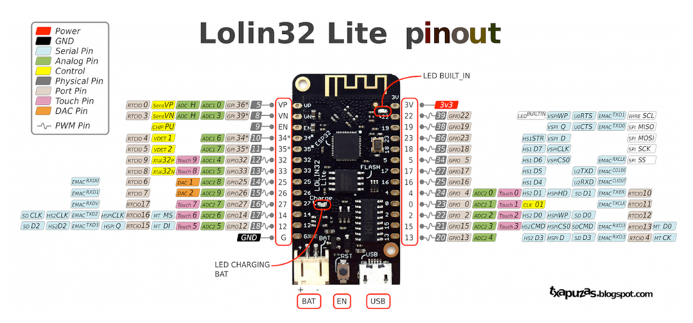

# ESP32 Notifier for Home Assistant

PlatformIO firmware for an ESP32-based Wi-Fi audio notifier / speaker with:

- ESP32 Arduino framework
- local web UI with separate HTML, CSS, and JavaScript assets
- Wi-Fi station mode plus fallback AP configuration mode
- MQTT command and state bridge for Home Assistant
- I2S audio output for MP3 streams, radio streams, and URL-based TTS playback
- OTA checks and installs from a GitHub release or manifest URL
- battery voltage monitoring with smoothing and calibration
- OLED status display support for SSD1306 and SH1106 panels
- compile-time defaults plus saved settings in Preferences / NVS

This project is not ESPHome. It is a custom modular PlatformIO firmware baseline intended to be realistic, buildable, and extendable.

## Project Overview

This notifier project is based on the third hardware iteration of a Home Assistant speaker / notifier build.

The main design goal of that iteration was to simplify the previous versions and make the system more practical for day-to-day use:

- low-voltage operation instead of bulkier higher-voltage amplifier setups
- reduced heat inside a printed enclosure
- less interference and easier wiring
- battery-capable operation
- the ability to drive an existing passive ceiling speaker when needed
- a compact all-in-one Home Assistant audio endpoint without adding a separate Bluetooth speaker

The intended usage is broader than simple beeps. The device is meant to handle:

- Home Assistant speech and notification playback
- soft background music
- internet radio streams
- compact room audio for built-in speakers or powered speakers

The firmware in this repository documents and supports that direction, while keeping the implementation focused on maintainable ESP32 firmware modules.

## Current Status

The repository builds successfully with PlatformIO and emits [firmware.bin](.pio/build/esp32_notifier/firmware.bin) locally.

The Home Assistant integration currently prioritizes the reliable MQTT URL-command path:

- `play URL`
- `play TTS URL`
- `stop`
- `set volume`

The firmware publishes MQTT state for:

- availability
- playback
- battery voltage
- Wi-Fi / network status

Native Home Assistant `media_player` semantics are not fully implemented yet. See the limitations section.

## Dev Board

This project is intended around the Wemos / LOLIN32 Lite style ESP32 board.

The original hardware write-up also references the LOLIN32 Mini class board family because those boards integrate useful battery features such as:

- Li-Po connector
- charger circuitry
- battery protection

That makes them a practical fit for a compact battery-backed notifier. One important note from the hardware overview is that battery-voltage measurement still requires an external divider on a free ADC-capable GPIO.

Reference links and local documentation:

- Dev board page: https://www.espboards.dev/esp32/lolin32-lite/
- Board documentation PDF: [Docs/Wemos-ESP32-Lolin32-Board-BOOK-ENGLISH.pdf](Docs/Wemos-ESP32-Lolin32-Board-BOOK-ENGLISH.pdf)
- Case / enclosure files: [3D](3D)
- Demo / reference video: https://www.youtube.com/watch?v=mt_Qr-lGUJ4

Pinout image used for this board:



## Hardware Wiring

Known required pins:

| Function | GPIO |
|---|---:|
| Status LED | 22 |
| Battery ADC | 36 |
| I2S DOUT | 25 |
| I2S LRCLK / WS | 26 |
| I2S BCLK | 27 |
| OLED SDA | 21 |
| OLED SCL | 19 |

OLED assumptions:

- 0.96 inch I2C OLED
- SSD1306 128x64 or SH1106 128x64
- default I2C address `0x3C`

## Hardware Modules

The project overview describes a compact module stack built around readily available boards:

- ESP32 LOLIN32 Lite / Mini style controller board
- UDA1334 I2S stereo DAC / audio driver
- PAM8403 class-D amplifier module
- Li-Po battery pack
- passive speaker, including in-ceiling speaker use cases

Why this combination was chosen:

- the ESP32 board provides Wi-Fi, battery charging convenience, and low-power control logic
- the UDA1334 cleanly handles I2S audio output without forcing a specific integrated amplifier choice
- the PAM8403 is small, cheap, and good enough for notifier duty even if it is not an audiophile amplifier
- the battery-backed design makes the notifier easier to place without depending on a permanently available external supply

## Parts and Resources

The project overview explicitly calls out these practical resources:

- Main board family: LOLIN32 Lite / Mini style ESP32 board
- Audio DAC: UDA1334 I2S stereo module
- Amplifier: PAM8403 class-D amplifier board
- Power: Li-Po battery pack, approximately `1800 mAh` in the example build
- Extra passive components: bulk capacitor and wiring as needed

Related external references mentioned in the overview:

- Home Assistant community schematic / discussion: https://community.home-assistant.io/t/i2s-stereo-to-play-mp3-tts-from-flash-on-boot/594740/6?u=elik745i
- Older notifier discussion: https://community.home-assistant.io/t/turn-an-esp8266-wemosd1mini-into-an-audio-notifier-for-home-assistant-play-mp3-tts-rttl/211499/224?u=elik745i
- External 3D model reference mentioned in the overview: https://www.thingiverse.com/thing:6910612

## Project Layout

- [platformio.ini](platformio.ini)
- [Docs/lolin32_lite_pinout.png](Docs/lolin32_lite_pinout.png)
- [Docs/Wemos-ESP32-Lolin32-Board-BOOK-ENGLISH.pdf](Docs/Wemos-ESP32-Lolin32-Board-BOOK-ENGLISH.pdf)
- [3D](3D)
- [include/default_config.h](include/default_config.h)
- [include/settings_schema.h](include/settings_schema.h)
- [include/version.h](include/version.h)
- [src/main.cpp](src/main.cpp)
- [src/settings_manager.cpp](src/settings_manager.cpp)
- [src/wifi_manager.cpp](src/wifi_manager.cpp)
- [src/mqtt_manager.cpp](src/mqtt_manager.cpp)
- [src/audio_player.cpp](src/audio_player.cpp)
- [src/ota_manager.cpp](src/ota_manager.cpp)
- [src/web_server.cpp](src/web_server.cpp)
- [src/battery_monitor.cpp](src/battery_monitor.cpp)
- [src/display_manager.cpp](src/display_manager.cpp)
- [src/ha_bridge.cpp](src/ha_bridge.cpp)
- [web/index.html](web/index.html)
- [web/style.css](web/style.css)
- [web/app.js](web/app.js)
- [home_assistant/example_package.yaml](home_assistant/example_package.yaml)
- [home_assistant/example_scripts.yaml](home_assistant/example_scripts.yaml)
- [home_assistant/example_automations.yaml](home_assistant/example_automations.yaml)

## Library Choices

- Async web server: `ESPAsyncWebServer` with `AsyncTCP`
- MQTT: `AsyncMqttClient`
- JSON: `ArduinoJson`
- Audio playback: `schreibfaul1/ESP32-audioI2S` pinned to the last tag compatible with this ESP32 toolchain and framework line
- OLED: `Adafruit SSD1306`, `Adafruit SH110X`, `Adafruit GFX`
- Storage: `Preferences`

The audio library was intentionally pinned to an older compatible tag because newer tags require C++ and ESP-IDF features not available in the default PlatformIO ESP32 Arduino toolchain used here.

## Build Instructions

1. Open this folder in VS Code.
2. Install PlatformIO IDE if needed.
3. Build:

```powershell
pio run
```

4. Upload:

```powershell
pio run -t upload
```

5. Open serial monitor:

```powershell
pio device monitor -b 115200
```

## First Flash and Provisioning

On boot the firmware does this:

1. Loads saved settings from Preferences if present.
2. Otherwise applies hardwired defaults from [include/default_config.h](include/default_config.h).
3. Attempts Wi-Fi STA mode if an SSID is configured.
4. If STA credentials are missing or the connection does not come up in time, starts fallback AP mode.

Fallback AP behavior:

- AP SSID: `ESP32-Notifier-XXXXXX`
- AP password: `configureme`
- Config URL: `http://192.168.4.1`

The web UI is served in both AP mode and normal LAN mode.

## Web UI

The frontend is stored in separate files under [web](web) and embedded into firmware at build time by [scripts/asset_embed.py](scripts/asset_embed.py).

The page allows you to:

- inspect Wi-Fi, IP, MQTT, firmware, battery, playback, and heap status
- test playback with a URL
- stop playback
- adjust volume
- edit Wi-Fi, MQTT, OTA, battery, device, OLED, and web auth settings
- reboot
- factory reset saved settings
- trigger an OTA check or install

The visual structure and Wi-Fi provisioning flow intentionally follow the same practical template style used in your pressure transducer project.

## Enclosure and Assembly

The project overview describes a compact printed enclosure workflow:

- reuse existing 3D models where practical
- create custom CAD when no suitable enclosure exists
- confirm dimensions from PCB photos, caliper measurements, and known reference spacing
- secure the finished modules inside the enclosure with adhesive mounting rather than complicated brackets

Repository-local enclosure resources are available in [3D](3D).

The hardware story in the overview is useful context here: the case design was driven by the desire to keep the notifier compact, battery-friendly, and resistant to the heat problems caused by earlier amplifier choices.

## Hardwired Defaults and Saved Settings

Compile-time defaults live in [include/default_config.h](include/default_config.h).

Saved settings live in ESP32 Preferences / NVS and override compile-time defaults.

Precedence rules:

1. Saved settings from Preferences are loaded first if the settings marker exists.
2. If no saved settings are present, defaults from [include/default_config.h](include/default_config.h) are used.
3. Saving through the web UI writes persistent values that override defaults on future boots.

Persisted values include:

- Wi-Fi SSID and password
- MQTT host, port, username, password, client ID, base topic
- device and friendly name
- OTA repository, channel, asset template, manifest URL
- battery divider ratio, calibration, smoothing, clamps, interval, sample count
- saved volume
- OLED settings
- optional web auth settings

## MQTT Topics

Default base topic:

- `esp32_notifier`

Command topics:

- `esp32_notifier/cmd/play`
- `esp32_notifier/cmd/tts`
- `esp32_notifier/cmd/stop`
- `esp32_notifier/cmd/volume`

State topics:

- `esp32_notifier/availability`
- `esp32_notifier/state/playback`
- `esp32_notifier/state/network`
- `esp32_notifier/state/battery`
- `esp32_notifier/state/volume`

Example payloads:

Play URL:

```json
{"url":"https://example.com/stream.mp3","label":"Test Stream","type":"stream"}
```

Play TTS URL:

```json
{"url":"https://example.local/tts/doorbell.mp3","label":"Doorbell","type":"tts"}
```

Volume:

```json
{"volumePercent":55}
```

## Home Assistant Setup

Example HA files are included in [home_assistant](home_assistant).

Reliable current integration path:

1. Use MQTT to publish direct audio URLs to the device.
2. Use the included scripts and helper entities for play, stop, and volume.
3. If your TTS engine can expose a direct MP3 or stream URL, publish that URL to `cmd/tts`.

Important current limitation:

- Home Assistant's native `tts.speak` service targets a `media_player` entity.
- This firmware does not yet expose a full Home Assistant `media_player` entity with the protocol HA expects.
- That means `tts.speak` cannot be pointed at this device directly today without an HA-side adapter or future custom integration work.

Practical TTS options right now:

1. Use a TTS engine or workflow that can produce a directly reachable MP3/HTTP URL.
2. Publish that URL to `esp32_notifier/cmd/tts`.
3. Optionally use the included `script.esp32_notifier_speak_url` helper as the HA wrapper.

Media and radio playback are straightforward today because they are already URL-based.

## Sound Quality Notes

The original project overview includes two useful real-world expectations:

- with a basic passive ceiling speaker, the goal is practical speech and light background audio rather than hi-fi playback
- when connected to better powered speakers, the UDA1334-based I2S path can sound noticeably better than expected for such a small and inexpensive module stack

That matches the intended role of this firmware: reliable notifier and room-audio endpoint first, rather than a full-featured audiophile streamer.

## OTA From GitHub Releases

The firmware supports two OTA metadata strategies:

1. Preferred: a lightweight JSON manifest URL
2. Fallback: GitHub Releases API lookup

Recommended manifest shape:

```json
{
  "version": "v0.1.0",
  "url": "https://github.com/elik745i/ESP32-Notifier-for-Homeassistant/releases/download/v0.1.0/esp32-notifier-v0.1.0.bin",
  "asset": "esp32-notifier-v0.1.0.bin",
  "sha256": "<optional sha256>",
  "channel": "stable"
}
```

Release asset naming strategy used by default:

- `esp32-notifier-${version}.bin`

OTA notes:

- If a manifest provides `sha256`, the firmware verifies it while streaming the update.
- If no manifest is provided, the firmware falls back to GitHub release metadata and asset naming.
- OTA install is currently triggered manually from the web UI or API.

## Battery Monitoring

Battery monitoring is handled by [src/battery_monitor.cpp](src/battery_monitor.cpp).

Calculation path:

1. `raw ADC` averaged over `sampleCount`
2. `raw ADC -> ADC pin voltage` using `3.3 V * raw / 4095`
3. `ADC pin voltage -> battery voltage` using `dividerRatio`
4. `battery voltage -> calibrated voltage` using `calibrationMultiplier`
5. spike rejection / clamping to configured voltage limits
6. exponential smoothing using `smoothingAlpha`
7. publish filtered voltage to app state and MQTT

Configurable battery settings:

- divider ratio / multiplier
- calibration multiplier
- smoothing alpha
- min and max clamp
- update interval
- sample count

## OLED Behavior

OLED support is handled by [src/display_manager.cpp](src/display_manager.cpp).

Displayed layout:

- top row: IP address or AP SSID
- center: current media title, TTS preview, OTA state, or idle / setup text
- bottom row: Wi-Fi / MQTT / playback summary

The display refreshes on an interval and supports simple scrolling for longer center text.

## Factory Reset

Factory reset from the web UI clears Preferences and reboots.

After reset:

- saved settings are removed
- hardwired defaults become active again
- AP fallback will start if Wi-Fi is not configured by defaults

## Troubleshooting

- If Wi-Fi never connects, join the fallback AP and open `http://192.168.4.1`.
- If MQTT state never appears, check base topic, credentials, and broker reachability.
- If audio playback fails, test with a known good MP3 URL before debugging Home Assistant.
- If HTTPS stream playback fails, check certificate compatibility and the remote server response.
- If OTA checks fail, prefer a manifest URL first and verify asset naming.
- If battery voltage is wrong, confirm your divider ratio and calibration multiplier.

## Known Limitations

- Native Home Assistant `media_player` entity behavior is not fully implemented yet.
- HA `tts.speak` cannot directly target this firmware today because the firmware currently uses a reliable MQTT URL-command bridge rather than a native HA media player integration.
- Audio playback support is centered on the selected audio library's stream capabilities; some edge-case codecs and playlists may still need tuning.
- OTA installs are functional but still conservative: the preferred secure path is a manifest with SHA256.
- Web auth is basic HTTP auth, not a complete role-based access model.
- The current firmware focuses on output-only audio. No microphone or duplex audio path is implemented.
- The original Russian overview also mentions two-way voice communication as a broader idea, but that is not implemented in this firmware baseline.

## GitHub Push Readiness

The repository already includes:

- [platformio.ini](platformio.ini)
- [.gitignore](.gitignore)
- version constants in [include/version.h](include/version.h)
- CI workflow in [.github/workflows/platformio.yml](.github/workflows/platformio.yml)
- Home Assistant examples under [home_assistant](home_assistant)

Suggested push flow:

```powershell
git init
git checkout -b main
git add .
git commit -m "Initial ESP32 notifier firmware"
git remote add origin https://github.com/elik745i/ESP32-Notifier-for-Homeassistant.git
git push -u origin main
```

